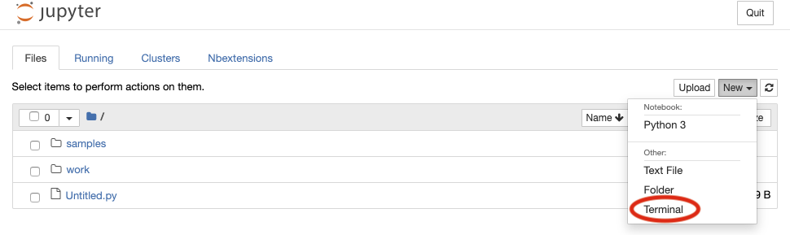
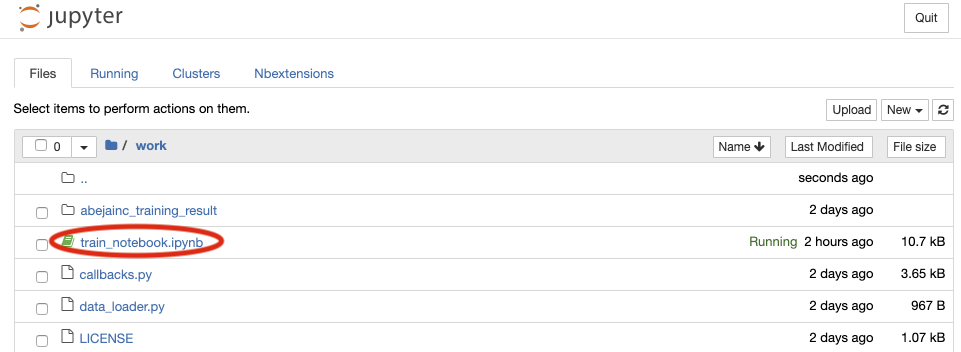

# abeja-platform-jupyter-samples
This repository is ABEJA Platform Jupyter samples.

## Available notebooks
You can use our template for Jupyter Notebook.

#### Open the terminal.

#### `git clone` repositories below. 

| Type | git link |
|---|---|
| [LightGBM for table data](https://github.com/abeja-inc/platform-template-tabledata-lightgbm) | git@github.com:abeja-inc/platform-template-tabledata-lightgbm.git |

#### Open `train_notebook.ipynb` and run cells one by one.

## Examples
You can refer examples below.

- [Image classification](https://github.com/abeja-inc/platform-template-image-classification)
- [Object detection](https://github.com/abeja-inc/platform-template-object-detection)
- [Image segmentation](https://github.com/abeja-inc/platform-template-image-segmentation)
- [lightgbm](https://github.com/abeja-inc/platform-template-tabledata-lightgbm)
- [scikit-learn](https://github.com/abeja-inc/platform-template-tabledata-sklearn)
